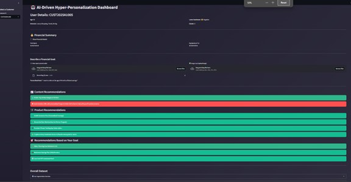

# 🚀 AtificialAI-Agents

## 📌 Table of Contents
- [Introduction](#introduction)
- [Demo](#demo)
- [Inspiration](#inspiration)
- [What It Does](#what-it-does)
- [How We Built It](#how-we-built-it)
- [Challenges We Faced](#challenges-we-faced)
- [How to Run](#how-to-run)
- [Tech Stack](#tech-stack)
- [Team](#team)

---

## 🎯 Introduction
The **Hyper-Personalization Dashboard** is an AI-driven web application designed to deliver personalized financial insights and recommendations. By leveraging customer data, sentiment analysis, clustering techniques, and advanced AI models for voice and image processing, the project aims to improve customer engagement and provide dynamic financial guidance.


## 🎥 Demo 
📹 [Video Demo](#) (attached in artifacts : aidhp-atificial-ai-agents\artifacts\demo)  
🖼️ Screenshots:



## 💡 Inspiration
The project was inspired by the increasing need for tailored financial services and customer experiences. With data-driven personalization at its core, the dashboard addresses the challenge of delivering the right insights at the right time, empowering users to make informed financial decisions.


## ⚙️ What It Does
- **Data Integration:** Loads and processes customer profiles, social media sentiment, and transaction data from an Excel dataset.
- **Customer Segmentation:** Utilizes KMeans clustering and feature engineering (including one-hot encoding for interests and preferences) to segment users.
- **Sentiment Analysis:** Uses transformer-based models to analyze customer sentiments from social media data.
- **Personalized Recommendations:** Offers targeted content and product recommendations based on user profiles, sentiment scores, and clustering results.
- **Multi-Modal Inputs:** Supports voice and image inputs to capture and interpret financial goals using ASR (Automatic Speech Recognition) and image captioning.
- **Interactive Dashboard:** Built with Streamlit, it provides an intuitive UI for real-time data visualization and actionable insights.


## 🛠️ How We Built It
The project was developed using Python with a focus on rapid prototyping and interactivity:
- **Streamlit:** For creating the web dashboard.
- **Pandas & NumPy:** For data manipulation and preprocessing.
- **Scikit-learn:** For machine learning tasks, including KMeans clustering and data encoding.
- **HuggingFace Transformers:** For sentiment analysis, voice transcription, and image captioning.
- **Matplotlib:** For data visualization.
- **Custom CSS:** Enhances the UI to deliver a modern and engaging user experience.

## 🚧 Challenges We Faced
- **Data Integration:** Combining heterogeneous data sources (customer profiles, social media, and transactions) into a single dataset.
- **Model Dependencies:** Ensuring the smooth integration of multiple AI models (sentiment analysis, ASR, image captioning) while handling potential load failures.
- **Real-Time Processing:** Balancing real-time user interactions with computationally intensive data processing.
- **UI/UX Design:** Creating an intuitive and visually appealing dashboard that delivers complex insights in a simple format.


## 🏃 How to Run
1. Clone the repository  
   ```sh
   git clone https://github.com/ewfx/aidhp-atificial-ai-agents
   ```
2. Install dependencies  
   ```sh
   pip install -r requirements.txt

   ```
3. Run the project  
   ```sh
   streamlit run main.py(if this doesnt work then -python -m streamlit run main.py )
   ```
4. Testcases  
   ```sh
   pytest test_main.py (install this if not present - 'pip install pytest')
   ```

## 🏗️ Tech Stack
- 🔹 Frontend: Streamlit (with custom CSS for enhanced UI)
- 🔹 Backend: Python
- 🔹 Data Processing: Pandas, NumPy
- 🔹 NLP & AI Models: HuggingFace Transformers (sentiment analysis, ASR, image captioning)
- 🔹 Machine Learning: Scikit-learn (KMeans, MultiLabelBinarizer)
- 🔹 Visualization: Matplotlib

## 👥 Team
- **Sanjana Rao** - [GitHub](https://github.com/sanjanarao31) | [LinkedIn](https://www.linkedin.com/in/sanjana-rao-78a56417b/)
- **D Neelamai**
- **Parameswara Chatta**
- **Mallappa Sajjan**
- **Abha Gupta**

## Acknowledgement
- **Streamlit**
- **Hugging Face Transformers**
- **Scikit-learn**
- **All other contributors and open-source libraries that made this project possible.**